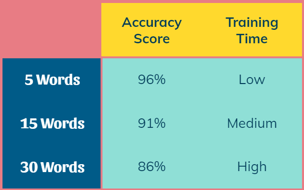
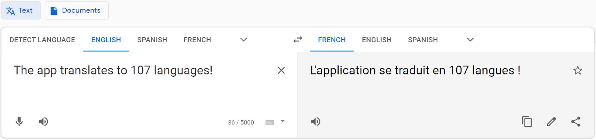

# Image Classification & Translator Capstone Project

### Problem Statement
 
Can I build an image classification model that will generate a translation to any language from an uploaded picture?

### Executive Summary
 
This idea stemmed from spending months in Montreal over the past year and not being able to fully immerse myself in the city due to speaking very little French. I am a visual learner and have never gotten much out of language apps. I thought a useful and fun way for people like me to learn a language would be to take pictures of objects around them and have a translation pop up in real time. This presentation is directed at language apps (like Duolingo) to be used as an add on to existing lessons.

All data sources I found were either too big or too small to use for my purpose. The original data source that inspired this project had 10,000 words with 1 million pictures total - doing anything with it took longer than the amount of time we had. I wanted to start with a short list of words, but have a decent amount of pictures for each in order to assure high accuracy. I found that the Google image search API was useful for pulling high quality pictures, but was limited in quantity it allowed at a time. Bing had no limit to how many pictures I could pull, but found that the quality suffered. I used a combination of smaller datasets from Kaggle and other similar sources along with my own images pulled from these two search engines. Creating my own dataset required more data cleaning to parse through images. I wrote a code that would skim through the files to check if they would work before putting into my actual model.

The most words i could get to work in the time we had was 30, each having between 800 to 1200 images associated with them, with the average around 1000 each. The categories I chose to focus on where common objects around the house, kitchen items, and clothing. After testing each word in a separate file, I added a few at a time and monitored the progress. I tried using neural networks that i built myself and the pre-built ones. I found that Xception worked the best, giving me high accuracy and quick timing. This uses the weights pre-trained on ImageNet. When fitting to my data I ran through global average pooling 2D and one hidden dense layer before my final output.

The below image shows my accuracy scores as I increased my word count:

 

The Google translate API is extremely easy to use. I am able to translate any word instantly, so I created a file with functions and imported them into my app seamlessly. First, the user selects the language & uploads an image. After the model is finished classifying the image, the word and language are passed into the translator function.

 

### Table of Contents

[Data Collecting with Image Search API](imagesearch.ipynb)

[Data Cleaning & Testing  Words Before Modeling](purgatory_testing.ipynb)

[Modeling with 30 Word Classes](model_30.ipynb)

[Translator](translator.ipynb)

[Streamlit App](translator_app.py) 

[Presentation](capstone_translator.pdf)

[Images](images/)
 
### Data Sources

MMID Downloads: https://multilingual-images.org/downloads.html

Apparel Images: https://www.kaggle.com/trolukovich/apparel-images-dataset

Furniture Images: https://data.mendeley.com/datasets/fpctx3svzd/1

The rest were pulled myself from Google Image Search & Bing Image Search

The data can be found in this Google Drive folder:
https://drive.google.com/drive/folders/15XfFXI8ks2y0dL5UJZruZeg7Dy170JT2?usp=sharing

### Conclusions & Recommendations

I can accurately predict 86% of the 30 word categories. Fine-tuning needs to be completed in order to add more words with successful accuracy. For now, the app is useful to those who are looking to learn common items around the house. It cannot be used as a full-scale translator, but it is a fun tool as a starting point.

I recommend using the Xception module in order to do a multi-class classification like this. The ImageNet datasource it uses is great for the purposes of classifying everyday objects.

### Areas for Further Research/Study

The first addition i would make to this project would be to add more words. I’ve prepped 50 total words, but have not trained the model on them. 

I also saw many datasets, that are extremely large, that would allow me to transform the project with object detection. This would allow the user to have a live video on their phone and see translations in real time.

Lastly, currently the translator detects english and translates to 107 languages, but it would be nice to change the origin language to anything.
