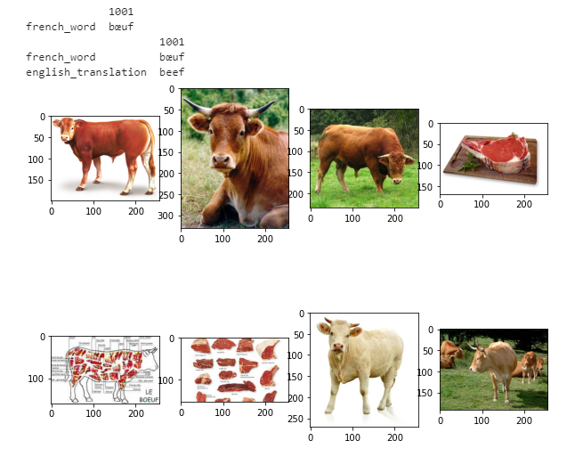
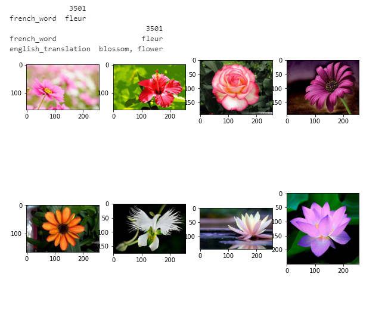

### Capstone Progress Report

My project is still in it's early stages of figuring out how to work with my data. I have changed my project idea since my original lightning talk, but have notified the instructors of the most recent idea.

I have found data called MMID (The Massively Multilingual Image Dataset). For each of it's ~100 includedlanguagues it has 10,000 words each containing 100 pictures. I was able to acquire one language, French, to test how my model can work before looking into others. The full folder contains almost 1M pictures. I've loaded into Jupyter Lab and performed some EDA to see how the files work. The dataset also provides a dictionary of image to French word and a dictionary of the translations to English words.

Below are screenshots from my notebook showing the the first dataframe (the word in French), the second dataframe (the English translations), and a handful of images associated with it.

#### Folder number 1001: Boeuf - Beef

#### Folder number 3501: Fleur - Flower

#### Current solution to handling large dataset:
I am in the process of uploading the complete French dataset into my Google Drive. From here I will connect to a Google Colab notebook in order to run my models.

The providers of the data also included a "mini" image selection, which includes all 10,000 words, but only one picture for each. I am using this to make preliminary models in order to see if the images need any reshaping or adjustments. However, only have one image per class is going to give a irrelevant model, so I am only using to check for errors.

#### Timeline
I hope to have at least two languages uploaded by the beginning of this week. Over the next week I will focus on building the best model with each language. During the following week I will focus on making an app in order to show a demonstration of the translator to the group.

#### 1:1 Topics
1) Data Augmentation Ideas
2) Pre-trained Convolutional Neural Networks
3) How to measure/score my model
4) Alternatives to tensorflow (noted from Eric's capstone that there may be better options)
5) Tips on dealing with large image datasets
6) Building an app that reads the live webcam (seen in a few capstones)